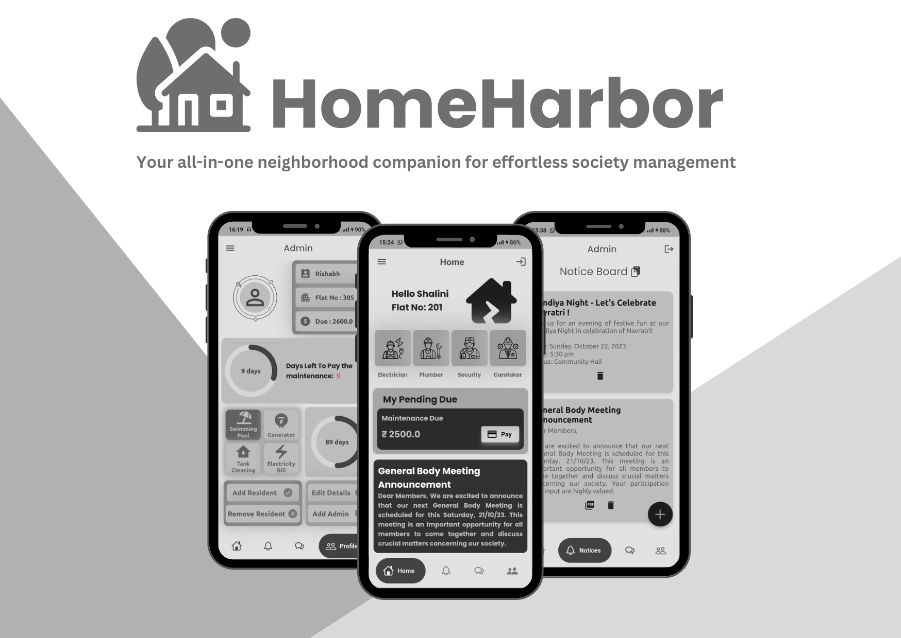

# Introduction
Welcome to the Society Maintenance and Notice Board App! This application is designed to simplify the process of paying maintenance fees and staying informed about important updates within your residential society.

Please note that this project is an ongoing work in progress. While it's functional and serves its core purpose, I have exciting plans to add many more features and improvements to enhance your experience.

## Data Handling and Authentication
I have implemented Firebase Firestore for robust data handling, ensuring that your society-related information is stored securely and efficiently. Additionally, our app features multi-role authentication using Firebase Authentication, allowing society members and administrators to access their respective functionalities with the appropriate level of authorization.

## Features
Current Features
Maintenance Payment: Easily pay your society maintenance fees through the app, making it convenient and hassle-free.

Notice Board: Stay updated with important announcements, notices, and events posted by the society management.

Chat with Neighbors: Connect with your neighbors through the app, fostering community interaction and making it easier to communicate and socialize with those around you.

## Upcoming Features
I am actively working on adding more features to make this app even more useful for society residents. Some of the upcoming features include:

Online Complaints: Report and track maintenance issues within your apartment or common areas.

Event Calendar: Keep track of upcoming events, meetings, and activities organized by the society.

Payment Reminders: Receive reminders for upcoming maintenance payments to ensure you never miss a due date.

Enhanced User Profiles: Customize your profile and add additional information for better community engagement.

Mobile Alerts: Get instant notifications for important updates and announcements.

